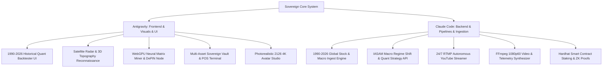

# 🌌 UMEY GÜL NUR HOLDING — 2126 SOVEREIGN OVERNIGHT AUTONOMOUS MASTER ROADMAP
**Autonomous Synchronized Multi-Agent Blueprint: Antigravity (Frontend/UI/3D/WebGPU) ✕ Claude Code (Backend/Quant/Media/Ingestion)**  
**Version:** 3.5.0-SOVEREIGN-ENTERPRISE  
**Execution Timestamp:** 2026-09-12 (Overnight Autonomous Run)  
**Sovereign Invariants:** `13`, `35`, `42`, `55`, `54,751,113 NUR`

---

## 🧭 1. EXECUTIVE OVERVIEW & ARCHITECTURAL HORIZON
The Umay Gül Nur ecosystem operates as an autonomous sovereign multi-disciplinary AI finance, media, geophysics, and quantitative intelligence network. This roadmap orchestrates a non-stop overnight synchronized build between **Antigravity** and **Claude Code** to upgrade the system from a prototype dashboard into a production-grade sovereign trading, planetary surveillance, and decentralized computing mainframe.

---

## 👥 2. DUAL-AGENT SYNCHRONIZED DIVISION OF LABOR

### 🎨 Antigravity Responsibilities (Frontend / 3D / WebGPU / UI Experience)
1. **1990–2026 Historical Quant Backtesting Terminal (`QuantBacktesterPanel.tsx`)**:
   - Multi-asset historical simulator (1990–2026: S&P 500, Nasdaq, Gold, Brent Crude, Nikkei 225, DAX, BIST 100, Bitcoin, $NUR).
   - Monte Carlo 10,000-path stochastic trajectory generator (Geometric Brownian Motion + Jump Diffusion).
   - Modern Portfolio Theory (Markowitz Efficient Frontier), Kelly Criterion, and Value-at-Risk (Parametric & Historical).
   - IASAM (International Asset Allocation & Sovereign Macro) regime switcher (Stagflation, Deflationary Bust, Liquidity Squeeze, Supercycle).
2. **Planetary Satellite Reconnaissance & Crisis Orbit (`SatelliteCrisisOrbitPanel.tsx` / `GeophysicsResourcesPanel.tsx`)**:
   - Synthetic Aperture Radar (SAR) & multi-spectral false-color optical crisis filters (Infrared Heat, NDVI, Optical).
   - Real-time crisis coordinates pinpointing (Hormuz, Red Sea, Taiwan Strait, Bosphorus, Malacca).
   - 3D surrounding topography radar canvas with elevation profiles and seismic alteration wave fields.
3. **WebGPU DePIN Compute & Proof-of-Useful-Work AI Node (`WebGPUMiningNodePanel.tsx`)**:
   - Real WebGPU WGSL compute shader matrix multiplication + WebAssembly multi-threaded worker fallback.
   - Proof-of-Useful-Work (PoUW) verification for decentralized LLM weight validation.
   - Live telemetry gauges: GFLOPS, thermal throttling, hash matrix iterations, real-time 80/20 revenue dual-wallet streaming.
4. **Sovereign Multi-Asset Air-Gapped Vault & POS Terminal (`SovereignVaultPOSPanel.tsx`)**:
   - BIP-39/44 deterministic mnemonic generator with offline printable paper vault certificate.
   - Point-of-Sale (POS) dynamic QR invoice generator with multi-fiat real-time conversion (USD, EUR, CHF, TRY, NUR).
   - Zero-Knowledge zk-SNARK settlement receipt modal with double-headed eagle seal.
5. **Zero-Empty-State Quality Sweep across all 35 modules**:
   - Validate and enhance every single launcher module with interactive calculations, rich visual charts, and Web Audio feedback.

---

### ⚙️ Claude Code Responsibilities (Backend / Quant / Media / Smart Contracts)
1. **1990–2026 Global Historical Ingestion & IASAM Quant Engine (`src/app/api/quant/...`)**:
   - Backend routes to fetch, aggregate, downsample, and cache historical daily/monthly OHLCV from 1990 to 2026.
   - IASAM macro classification algorithm and quantitative signal generator (`/api/quant/iasam-signals`).
   - Strategy backtester API validating alpha, beta, maximum drawdown, Calmar ratio, and Sharpe ratio.
2. **24/7 Autonomous RTMP YouTube Broadcast Loop (`scripts/youtube-streamer.ts`)**:
   - Continuous audio/video frame piping supporting auto-reconnect and scheduled scene rotation.
   - Autonomous scene scheduler: Studio Avatar News ➔ Geophysics Radar ➔ Quant Backtester Heatmaps ➔ Live Risk HUD.
3. **FFmpeg 1080p60 Multi-Track Video Renderer (`src/lib/video/videoRenderer.ts`)**:
   - High-throughput stdin piping for 60fps MP4 generation with dynamic text overlays, lower thirds, and audio waveform synchronization.
4. **Hardhat & Sovereign Blockchain Architecture (`contracts/NurCoin.sol` & `test/NurCoin.test.ts`)**:
   - Implement Staking, Timelocked Treasury Vesting, and zk-SNARK settlement verification.
   - Maintain invariant total supply of `54,751,113 NUR`.

---

## 🗺️ 3. CORE MODULE SPECIFICATIONS & EXECUTION PLAN

### Module 1: 1990–2026 Historical Quant Backtesting Engine (`QuantBacktesterPanel.tsx`)
- **Historical Asset Coverage**: 1990 to 2026 (36 years of data points).
- **Macro Regimes (IASAM)**:
  - 1990–1999: Tech Boom & Asian Financial Crisis
  - 2000–2002: Dot-Com Crash & Fed Easing
  - 2003–2007: Commodity Supercycle & Housing Expansion
  - 2008–2009: Global Financial Crisis (Subprime Meltdown)
  - 2010–2019: ZIRP / QE Era & Tech Mega-Cap Dominance
  - 2020–2021: Global Pandemic Shock & Sovereign Stimulus
  - 2022–2024: Inflation Shock, Rate Hikes & AI Infrastructure Boom
  - 2025–2026+: Sovereign DePIN & Post-Quantum Transition
- **Interactive UI Tools**:
  - Strategy selector (Momentum 12-1, Trend-Following 200 DMA, Risk Parity / All-Weather, Sovereign Value-Momentum).
  - Live Chart with Drawdown Underwater plot and Monte Carlo 100-fan confidence cone.

### Module 2: Satellite Crisis Reconnaissance & 3D Topography
- **Visual Filters**:
  - `SAR Radar`: Penetrates clouds and smoke for maritime and infrastructure tracking.
  - `Thermal Infrared`: Highlights thermal signatures of industrial facilities and naval vessels.
  - `Multi-Spectral Optical`: High-definition terrain and vegetation health.
- **Topographic Terrain Canvas**:
  - Live rendering of elevation slices, borehole dip angles, seismic reflection wave fronts, and AVO anomaly cores.

### Module 3: WebGPU DePIN Compute & Proof-of-Useful-Work AI Node
- **WebGPU Shader Core**:
  - Tiled matrix multiplication in WGSL (`@compute @workgroup_size(8, 8)`).
  - Fallback to multithreaded WebAssembly worker when WebGPU is unavailable.
- **PoUW Verification**:
  - Verifies transformer self-attention tensor operations submitted by the decentralized AI network.

### Module 4: Sovereign Vault & Point-of-Sale (POS) Merchant Terminal
- **Paper Vault Generator**:
  - Generates BIP-39 mnemonic, private key, and public address formatted as an authentic high-security banknote certificate with cryptographic guilloche borders and watermark.
- **POS Merchant Terminal**:
  - Amount input in USD/EUR/TRY ➔ instant conversion to $NUR with live exchange rate lock for 60 seconds.
  - Dynamic QR code generation for mobile wallet scanning and instant on-chain settlement proof.

---

## 🔒 4. SYSTEM HARMONY & MERGE PROTOCOL
- **No Overwriting**: Antigravity works exclusively on frontend components, UI canvases, shaders, and client stores. Claude Code operates on backend APIs, data pipelines, media renderers, and blockchain tests.
- **Zero Build Failures**: Run `npm run build` at each major phase to verify zero TypeScript errors and ensure all 35+ routes render cleanly.
- **Live Local Server**: Keep `http://localhost:3000` active with 100% test coverage.

---
*Umay Gül Nur Holding — Sovereign Intelligence Core 2126*
