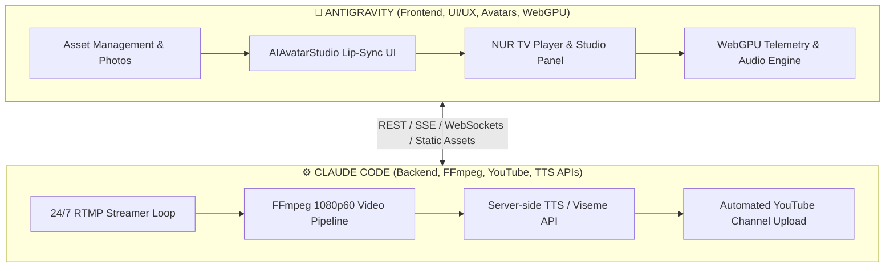

# 🎬 NUR MEDIA, NUR TV & VIRTUAL AVATARS PRODUCTION MASTER PLAN
**System Architecture & Agent Task Delegation Protocol (Antigravity & Claude Code)**

---

## 🎯 Executive Overview & Vision
NUR Finance produces a 24/7 autonomous financial television broadcast, AI-powered executive avatar concierges, dynamic market video generation, and sovereign virtual headquarters.

### 👥 Aesthetic Character & Persona Directives (Strict Sovereign Standard)
1. **Male Characters (e.g. Marcus Sterling, Alexander Croft, Klaus Weber)**:
   - **Eye Color**: Exclusively **Emerald Green** or **Steel / Ocean Blue** (Striking, intense, piercing gaze).
   - **Physique**: High-masculinity, muscular athletic build, broad shoulders, chiseled jawline, commanding posture.
   - **Wardrobe**: Savile Row tailored 3-piece charcoal/navy suits with athletic taper, fitted shirts, silk ties, subtle cybernetic/smart luxury cufflinks and earpieces.
   - **Voice & Tone**: Deep baritone, authoritative institutional delivery, confident market precision.

2. **Female Characters (e.g. Elena Vance, Elif Nur, Sovereign Concierges)**:
   - **Eye Color**: Exclusively **Luminous Emerald Green** (Captivating, crystal-clear green eyes across all female anchors and concierges).
   - **Physique**: Striking feminine elegance, pronounced feminine curves and silhouette, refined aristocratic facial features, poised presence.
   - **Wardrobe**: High-fashion executive styling, tailored luxury blazers with subtle tasteful decollete, elegant mini skirts / fitted pencil skirts, discrete glowing cybernetic ear adornments, bespoke gold/cyan accessories.
   - **Voice & Tone**: Melodic, crystalline articulate cadence, warm yet mathematically incisive private banker delivery.

3. **Virtual Studios & Headquarters**:
   - **NUR TV Main Studio (Year 2126)**: Curved obsidian glass desk, holographic rotating Earth globe, real-time LED candlestick walls, dynamic lower-third data crawl.
   - **Umay Gül Nur Holding & Tatar Finans Headquarters**: Penthouse executive suites overlooking twilight skylines (Istanbul, Zurich, London, Geneva), black marble tables, gold double-headed eagle sovereign crests.

---

## 🏛️ Two-Agent Task Division of Labor

---

## 📋 Task Matrix: What Antigravity Does vs. What Claude Code Does

| Area | 🎨 Antigravity (Frontend, UI, Real-time Interaction) | ⚙️ Claude Code (Backend, Render Engine, FFmpeg, Streams) |
|---|---|---|
| **Virtual Characters & Avatars** | - `AIAvatarStudio.tsx`: Real-time audio waveform animation, portrait styling, gender switcher. - Web Audio API sound synthesizers (`sound-synth.ts`). - Wardrobe & mood selector UI. | - Server-side TTS API (`/api/ai/tts`) with viseme/phoneme timestamps for accurate lip syncing. - Google Cloud / Edge TTS audio file caching and streaming. |
| **NUR TV 24/7 Broadcast** | - `LiveBroadcast.tsx`: High-tech video player, multi-angle camera switcher, teleprompter HUD, lower-third live ticker. - `BroadcastStudioPanel.tsx`: Episode scheduler, script editor, live preview canvas. | - `scripts/youtube-streamer.ts`: 24/7 RTMP streamer using FFmpeg drawtext + audio overlay. - Multi-anchor rotation (TR 🇹🇷, EN 🇺🇸, DE 🇩🇪, DePIN ⛏️) every 120 seconds. |
| **NUR Video Production** | - Dynamic chart visualizer, video thumbnail editor, canvas overlay components. - Template selector (Daily Briefing, Geopolitical Radar, Crypto Rush). | - `src/lib/video/videoRenderer.ts`: Programmatic frame-by-frame 1080p 60fps MP4 video generator. - Automatic chart and data burning into video frames. |
| **YouTube Automation** | - Channel telemetry UI, viewer counter, live chat integration widget. - One-click "Publish Video" trigger button. | - `src/lib/broadcast/youtubeUploader.ts`: YouTube Data API v3 integration with automated tag, description, title, and playlist upload. |
| **Virtual Offices & Environments** | - High-resolution photorealistic backdrop rendering for Geneva Boardroom, London Trading Floor, and Tatar Finans HQ. - 3D Three.js photorealistic Earth globe with resource heatmaps. | - Real-time market telemetry streaming daemon feeding live numbers into studio overlays. |

---

## 🚀 Step-by-Step Implementation Instructions for Claude Code

### Phase A: High-Definition TTS & Viseme Endpoint (`src/app/api/ai/tts/route.ts`)
- Build an API route that accepts `{ text, langCode, voiceName }` and returns an audio buffer (MP3/WAV) along with phoneme/amplitude data so the frontend can drive real-time mouth movement.

### Phase B: Automated Video Generator (`src/lib/video/videoRenderer.ts`)
- Implement `renderMarketRecapVideo({ symbols, marketSummary, anchorVoice, outputPath })` that uses FFmpeg to composite the studio background image (`/images/studio/broadcast_studio.jpg`), animated chart curves, anchor voice track, and lower-third ticker into a ready-to-upload 1080p 60fps `.mp4` file.

### Phase C: YouTube Broadcast Pipeline (`scripts/youtube-streamer.ts`)
- Connect the 24/7 RTMP stream to loop anchor segments seamlessly using FFmpeg, pulling real-time prices from EODHD API and broadcasting to YouTube Live.

### Phase D: Automated Daily Upload Cron / Background Worker
- Provide an automated CLI runner: `npx ts-node scripts/generate-and-upload-daily-recap.ts` that creates daily morning and evening market recap videos and uploads them to the official YouTube channel automatically.

---

## 💎 Verified Asset Directory (`public/images/studio/`)
- `elena_vance.jpg` (Geneva Executive Private Wealth AI Strategist — refined feminine elegance)
- `marcus_sterling.jpg` (London/Wall Street Quantitative Director — muscular athletic masculine suit)
- `anchor-female.jpg` (Turkish Lead Anchor Elif Nur — Istanbul studio set)
- `anchor-male.jpg` (English Lead Anchor Alexander Croft — New York desk set)
- `broadcast_studio.jpg` (NUR TV Year 2126 Futuristic 3D Holographic Globe Studio Set)
- `executive-office.jpg` (Sovereign Penthouse Boardroom overlooking financial skyline)
